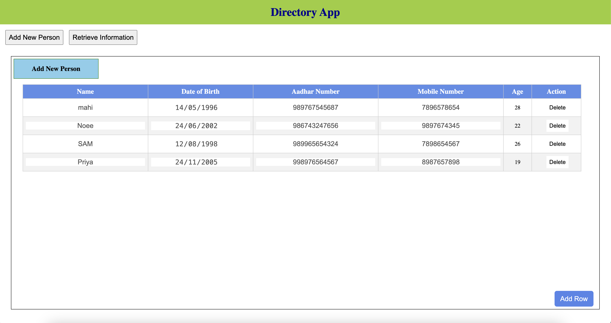
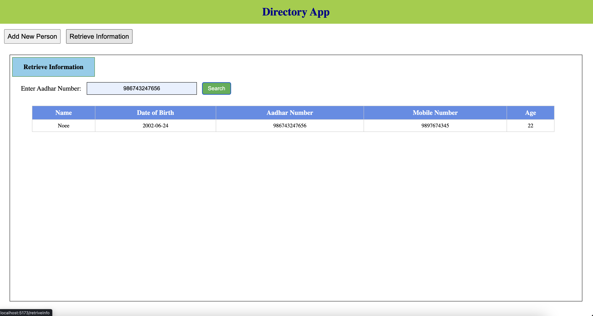

# Directory App

## Overview
The Directory App is a web-based application built with React that allows users to:
- Add new persons to a local directory.
- Retrieve information about a person by their Aadhar Number from the local storage.

## screenshot





## Features
1. **Add New Person**:
   - Users can add details such as Name, Date of Birth, Aadhar Number, and Mobile Number.
   - The application automatically calculates the age based on the entered Date of Birth.
   - Validation ensures that:
     - Aadhar Number is a 12-digit numeric value.
     - Mobile Number is a 10-digit numeric value.
     - All fields are mandatory.
   - Users can save or delete rows.
   - Saved data is stored in the browser's local storage.

2. **Retrieve Information**:
   - Users can search for a person's information using their Aadhar Number.
   - If a match is found in the local storage, all details related to the Aadhar Number are displayed in a table.
   - If no match is found, the app displays a "No match found" message.

## Technologies Used
- **Frontend**:
  - React
  - React Router
- **Storage**:
  - Browser Local Storage

## Installation and Setup
1. Clone the repository:
   ```bash
   git clone <repository_url>
   ```
2. Navigate to the project directory:
   ```bash
   cd directory-app
   ```
3. Install the dependencies:
   ```bash
   npm install
   ```
4. Run the app:
   ```bash
   npm start
   ```
5. Open your browser and navigate to:
   ```
   http://localhost:3000
   ```

## Project Structure
```
src
├── App.css                # Main CSS file for the application
├── App.js                 # Main application component
├── Components
│   ├── AddNewPerson.js    # Component for adding a new person
│   ├── RetrieveInfo.js    # Component for retrieving information
├── index.js               # Entry point of the application
```

## Usage

### Add New Person
1. Click on the **Add New Person** tab.
2. Fill in the details for Name, Date of Birth, Aadhar Number, and Mobile Number.
3. Click **Save** to store the person's information in local storage.
4. Click **Delete** to remove a row.
5. Add multiple rows by clicking the **Add Row** button.

### Retrieve Information
1. Click on the **Retrieve Information** tab.
2. Enter a valid 12-digit Aadhar Number in the input field.
3. Click **Search**.
4. If a match is found, the person's details are displayed in a table.
5. If no match is found, the message "No match found" is displayed.

## Validation Rules
- **Aadhar Number**:
  - Must be a 12-digit numeric value.
- **Mobile Number**:
  - Must be a 10-digit numeric value.
- **All Fields**:
  - Must be filled in before saving.

## Styling
The app includes:
- A responsive design.
- Custom buttons, tables, and form inputs styled using CSS.

## Future Improvements
- Add a backend for persistent data storage.
- Enhance the UI with better design and animations.
- Include additional validation and error handling.
- Implement authentication and authorization for secure access.

## License
This project is licensed under the MIT License.